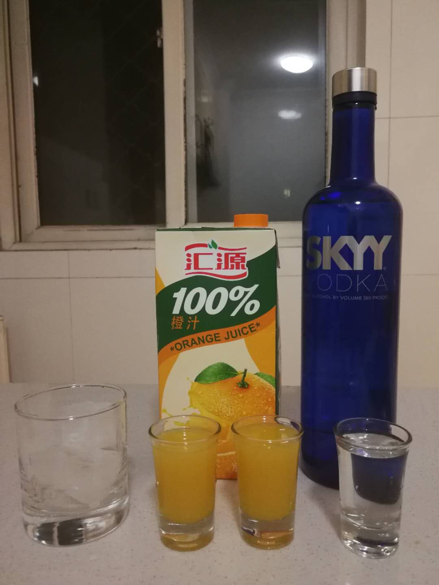
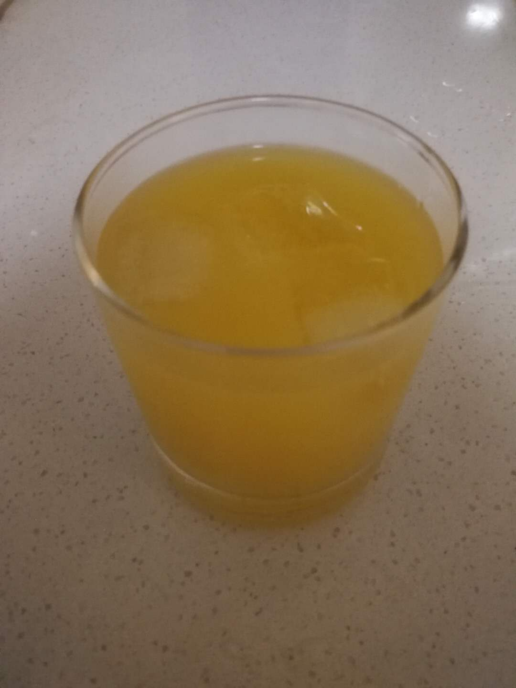

# 螺丝刀 Screwdriver

## 配方

材料          | 备注
------------ |----------------
伏特加        | 1.5 oz
柠檬汁或西柚汁 | 4.5 oz

## 准备

* 冰镇玻璃杯
* 冰块

## 步骤

* 依次放入冰块, 伏特加, 橙汁
* 后搅拌即可

## 特点

* 简单
* 酸甜度由果汁决定
* 易入口，女士推荐

## PS

* SKYY的vodka挺常见 新手选择恐惧症的话推荐
* .._:(´_`” ∠):_ …烦 工作日也来一杯

## 配图

