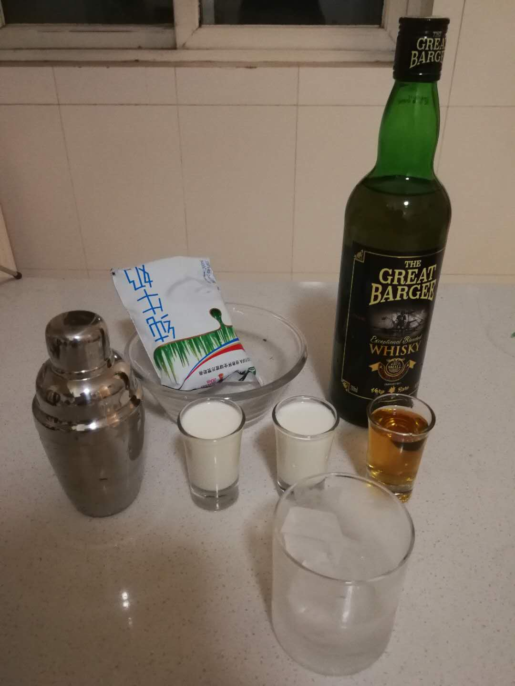

# 牛仔雞尾酒 the Cowboy

## 配方

* 威士忌+牛奶 （推薦1:2）

## 準備

* 冰鎮玻璃杯
* 冰塊

## 步驟

* 依次將冰塊, 牛奶, 威士忌倒入雪克杯（Shaker）
* 摇10下，倒出即可

## 特點

* 和混果汁的雞尾酒不同，牛奶口感較滑味道較淡，酒味更明顯

## 備注

* 有菜譜會選用白蘭地代替威士忌作為基酒
* 可選用淡奶油代替牛奶
* 沒有雪克杯的話用勺子攪拌也可以, 多攪一下

PS 啊 又淆過一天.._:(´_`」 ∠):_ …

## 配图

