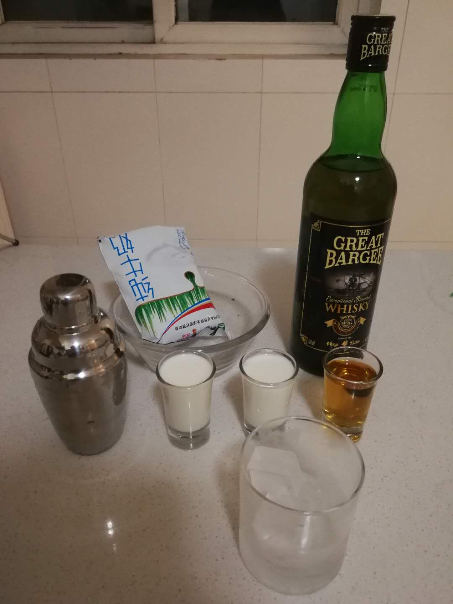
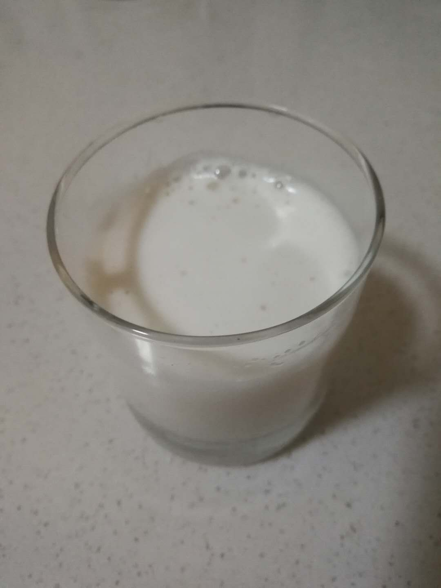

# 牛仔鸡尾酒 the Cowboy

## 配方

材料          | 备注
------------ |----------------
威士忌        | 1.5 oz
牛奶          | 4.5 oz

## 准备

* 冰镇玻璃杯
* 冰块

## 步骤

* 依次将冰块, 牛奶, 威士忌倒入雪克杯（Shaker）
* 摇10下，倒出即可

## 特点

* 和混果汁的鸡尾酒不同，牛奶口感较滑味道较淡，酒味更明显

## 备注

* 有菜谱会选用白兰地代替威士忌作为基酒
* 可选用淡奶油代替牛奶
* 没有雪克杯的话用勺子搅拌也可以, 多搅一下

PS 啊 又淆过一天.._:(´_`” ∠):_ …

## 配图

