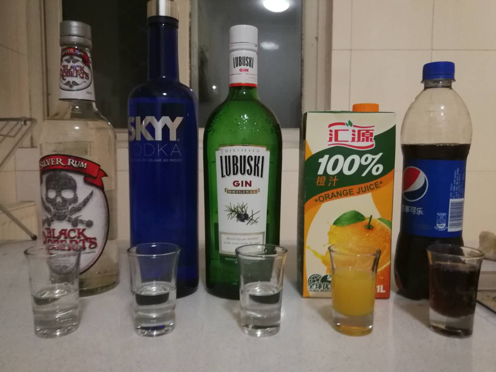
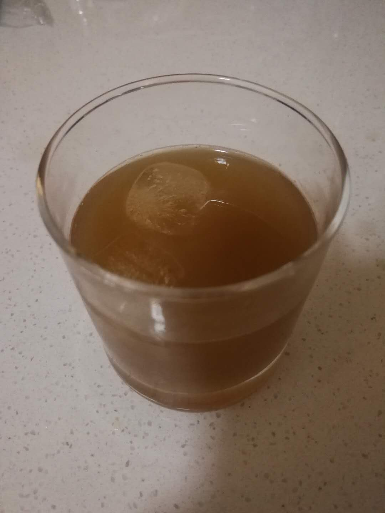

# 長島冰茶（偷工減料版）

## 配方

* 白朗姆+威士忌+琴酒+橙汁+可樂（推薦1:1:1:2:2）

## 準備

* 冰鎮玻璃杯
* 冰塊
* 雪克杯

## 步驟

* 依次將冰塊,橙汁,白朗姆,威士忌,琴酒倒入雪克杯（Shaker）摇10下
* 倒出到杯子
* 后加入可樂
* 再搞拌即可

## 特點

* 三種基酒混合, 相對易醉
* 味道迷之帶感，易入口

## 備注

* 和傳統配方不同, 篇幅受限就先不黏出來了, 有機會再補

## PS

* 老是一種酒混一種軟飲好像忽悠人, 今天來個複雜的 ｸﾞｯ!(๑•̀ㅂ•́)و✧

## 配图

