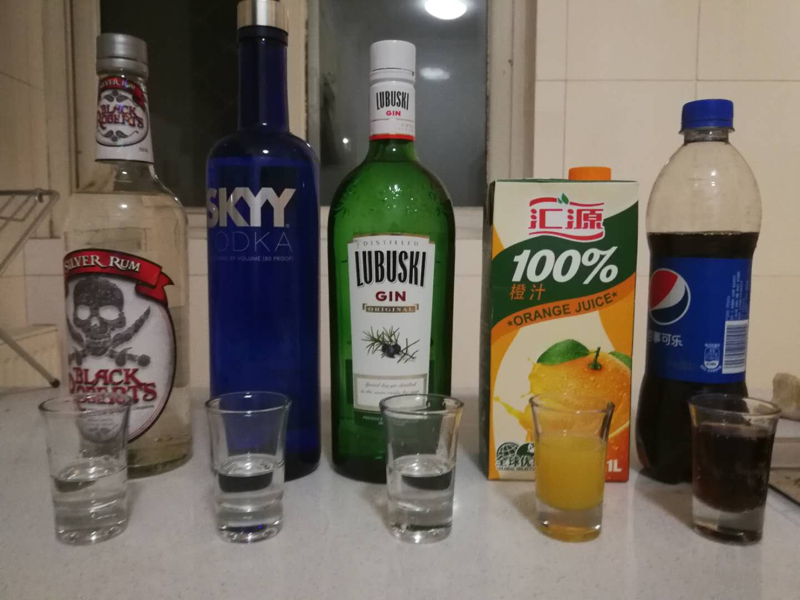
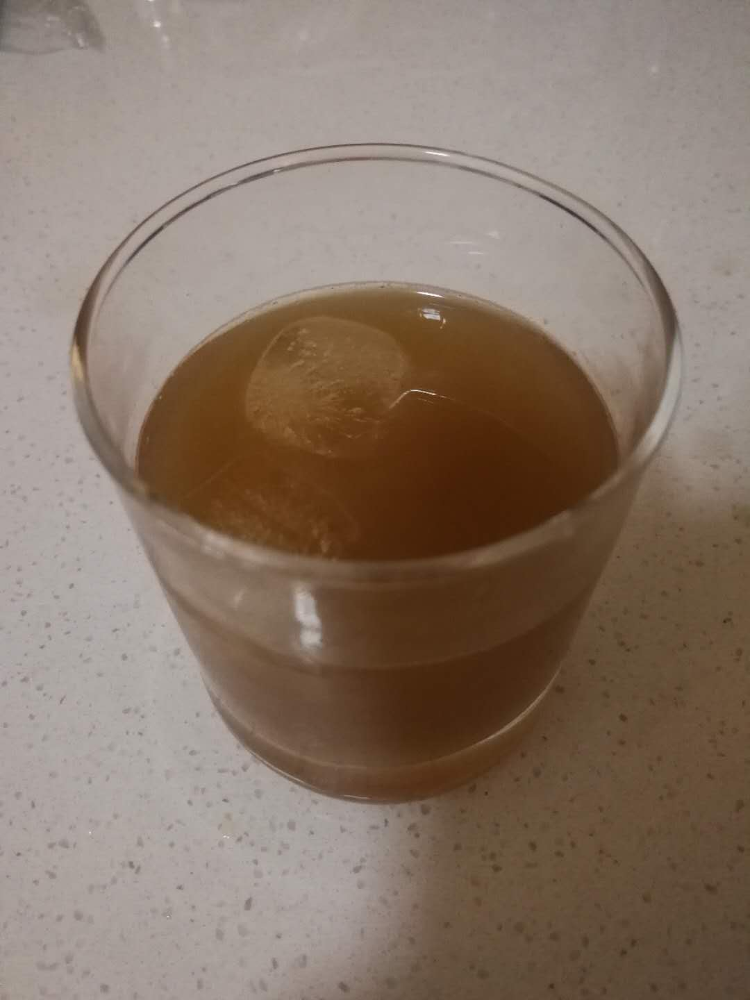

# 长岛冰茶（偷工减料版）

## 配方

* 白朗姆+威士忌+琴酒+橙汁+可乐（推荐1:1:1:2:2）

## 准备

* 冰镇玻璃杯
* 冰块
* 雪克杯

## 步骤

* 依次将冰块,橙汁,白朗姆,威士忌,琴酒倒入雪克杯（Shaker）摇10下
* 倒出到杯子
* 后加入可乐
* 再搞拌即可

## 特点

* 三种基酒混合, 相对易醉
* 味道迷之带感，易入口

## 备注

* 和传统配方不同, 篇幅受限就先不黏出来了, 有机会再补

## PS

* 老是一种酒混一种软饮好像忽悠人, 今天来个复杂的 ｸﾞｯ!(๑•̀ㅂ•́)و✧

## 配图

