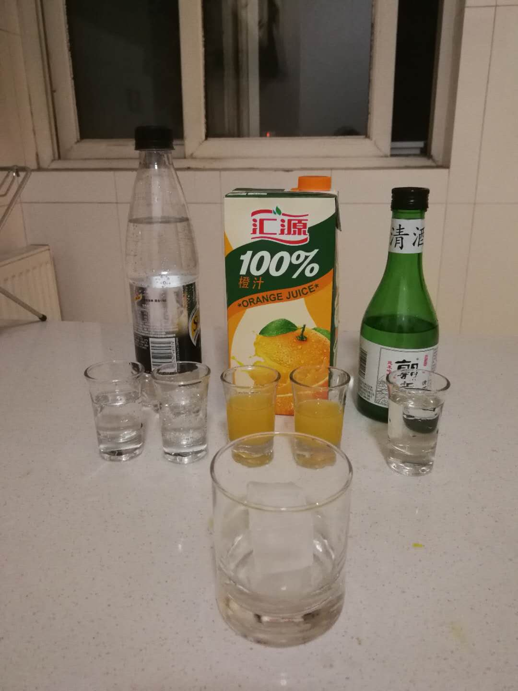
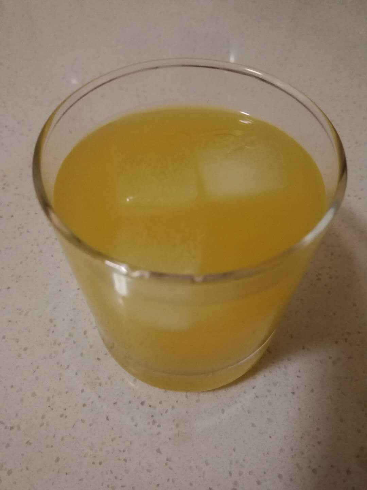

# 橙色微风 Mandarin Orange Breeze

## 配方

材料          | 备注
------------ |----------------
日本酒        | 1.5 oz
苏打水        | 2.5 oz
橙汁          | 2 oz
冰块          | 2块

## 步骤

* 冰镇酒杯
* 放入冰块
* 依次倒入日本酒, 橙汁, 苏打水
* 用调酒勺快速搅拌

## 备注

* 清酒有一点苦, 配合橙汁可以缓解苦味
* 清酒酒味不明显, 但有点后劲, 属于喝着喝发现喝多那种
* 苏打水主要是让鸡尾酒最终带有气泡口感

## 配图

