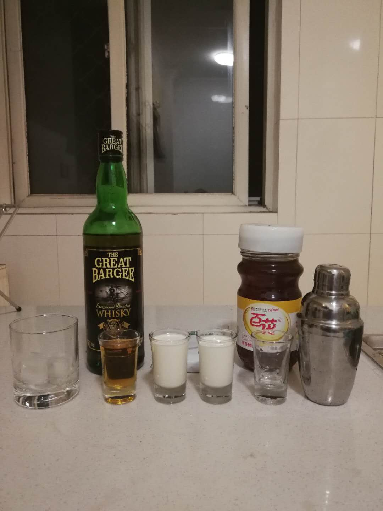
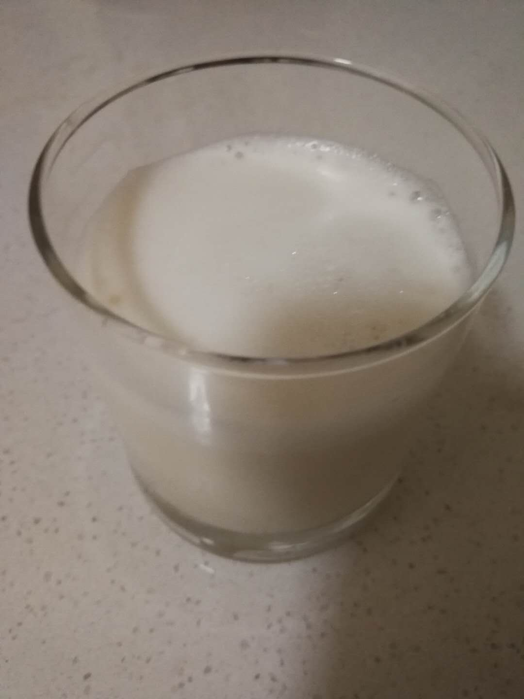

# 北国冬天 Bourbon Milk Punch

## 配方

材料          | 备注
------------ |----------------
威士忌        | 2 oz
牛奶          | 3 oz
蜂蜜          | < 0.5 oz
冰块          | 2块
磨碎的肉豆蔻   | 1个

## 步骤

* 适量稀释蜂蜜
* 冰镇酒杯
* 在雪克杯中依放入冰块, 牛奶, 蜂蜜, 威士忌
* 快速摇晃10下
* 倒出到酒杯, 撒上肉豆蔻粉

## 备注

* 蜂密需要适量稀释才能较好的混合，否则蜂蜜会沉底
* 威士忌和牛奶2:3的混合，威士忌的烈性口味会比较明显，可以因为个人口味调整

## 配图

