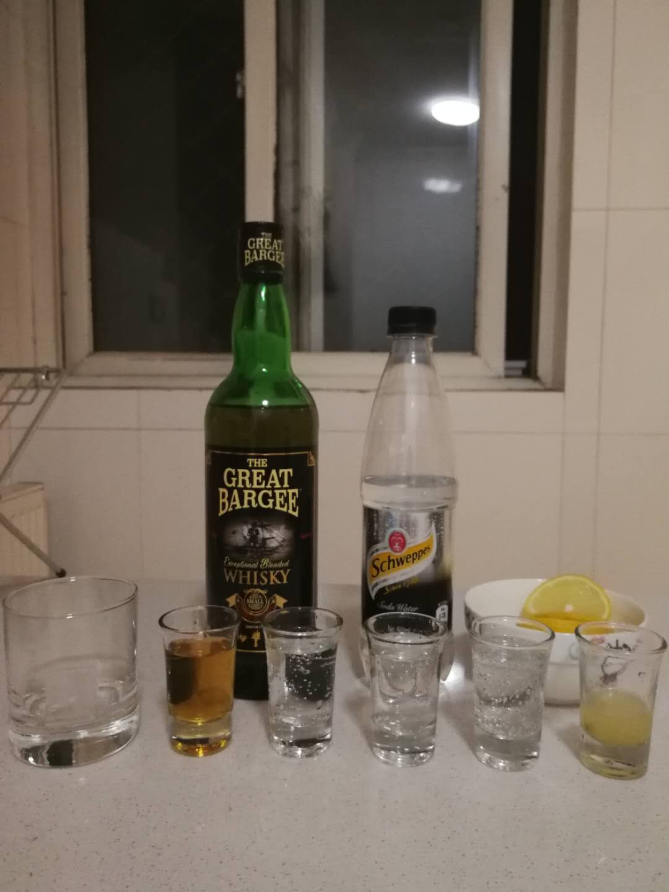
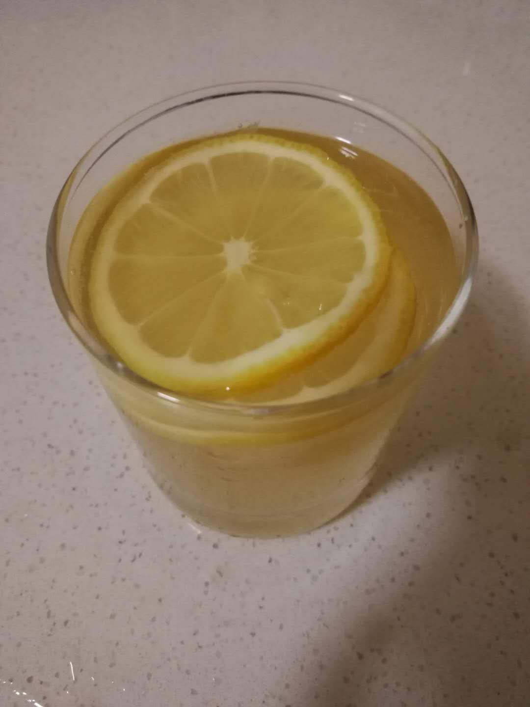

# 汽水威士忌

## 配方

材料          | 备注
------------ |----------------
威士忌        | 1.5 oz
苏打水        | 4.5 ~ 6 oz
柠檬片        | 1片
冰块          | 2块
柠檬汁        | 可选, 原本配方里没有, 视个人口味, 建议0.5oz以下

## 步骤

* 冰镇酒杯
* 放入冰块
* 依次倒入威士忌, 柠檬汁, 苏打水
* 用调酒勺快速搅拌
* 放上柠檬片

## 特点

* 苏打水主导了口感，喜欢汽水口感的可以份量多一点点
* 威士忌和苏打水的味道都比较淡，所以柠檬汁要适量，加太多会直接变柠檬汁

## 配图

