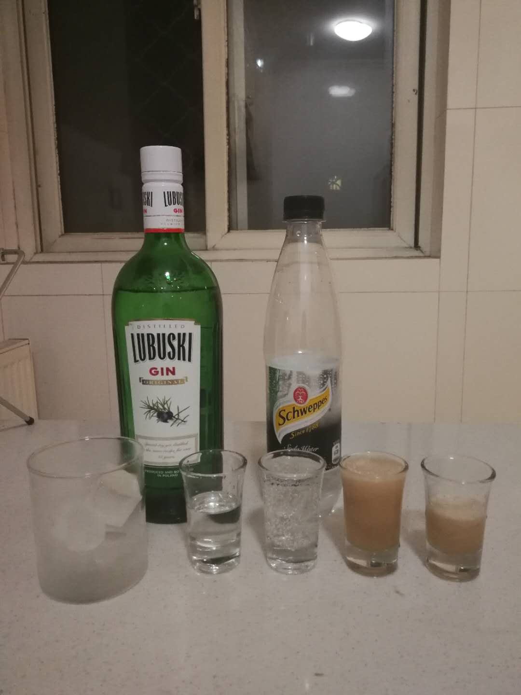
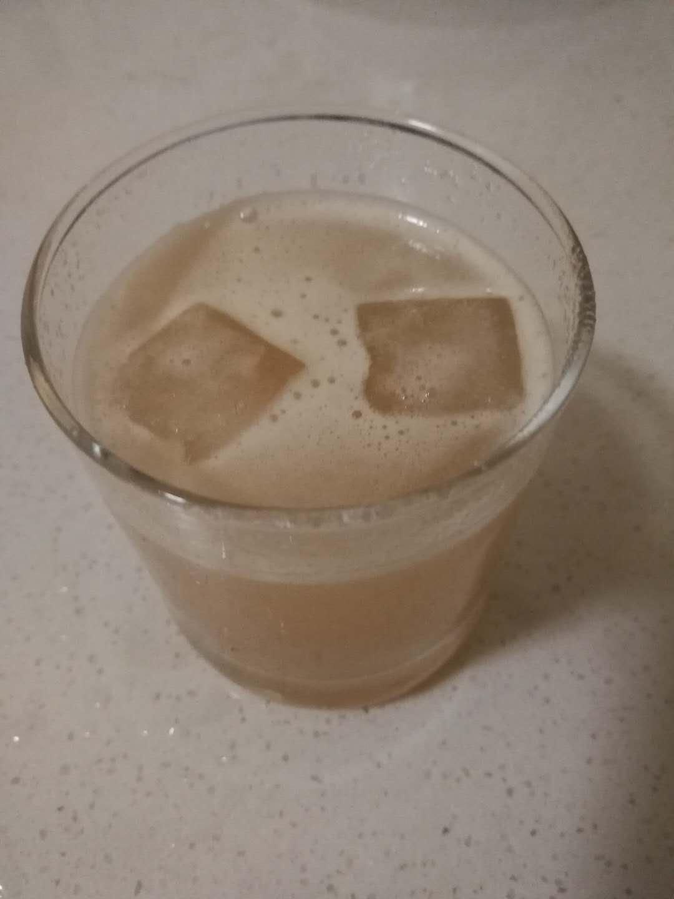

# 梨汁鸡尾酒 Pear Soda

## 配方

材料            | 备注
-------------- |----------------
琴酒            | 1 oz
梨汁            | 3 oz
苏打水          | 2 oz
糖酱            | 适量

## 步骤

* 冰镇酒杯
* 放入冰块
* 依次倒入威士忌, 梨汁, 苏打水, 糖酱
* 用调酒勺快速搅拌

## 备注

* 梨汁清爽, 適合夏天品嘗

## 配图

