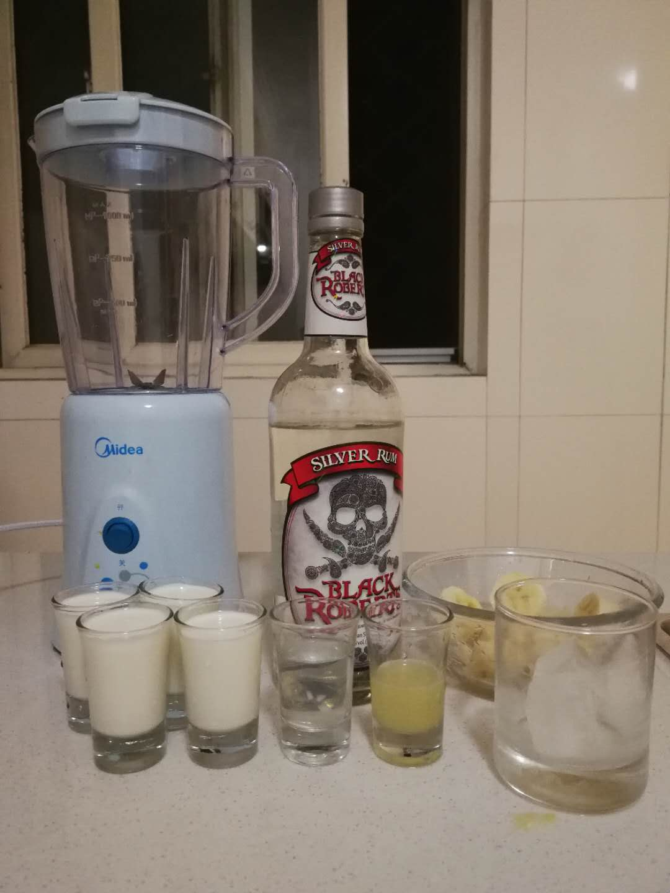
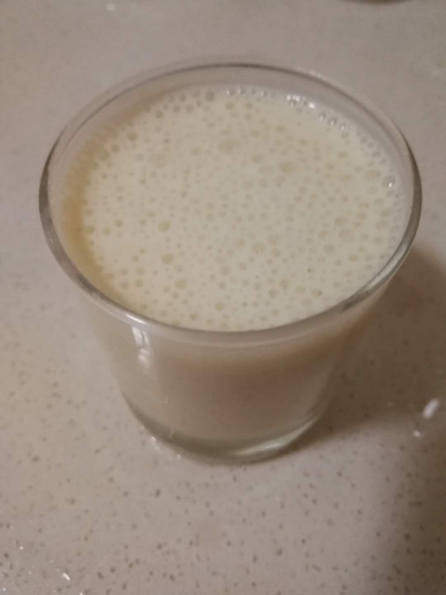

# 香蕉牛奶鸡尾酒 Anana Milkshake

## 配方

材料          | 备注
------------ |----------------
朗姆酒        | 1.5 oz
牛奶          | 7.5 oz
柠檬汁        | 一勺
糖            | 一勺
香蕉          | 中等大小
碎冰          | 建议两块到四块冰打碎而成

## 步骤

* 所有材料加到榨汁机中搅拌即可

## 备注

* 香蕉奶昔本身容易入口，对于酒精浓度高的酒能很好的覆盖酒的烈性
* 牛奶和香蕉的味道都比较重，可以根据个人口味减少比例

## 配图

