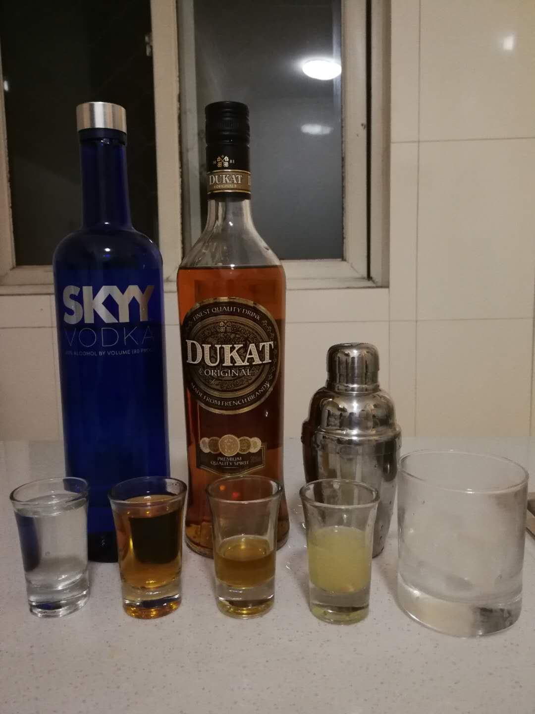
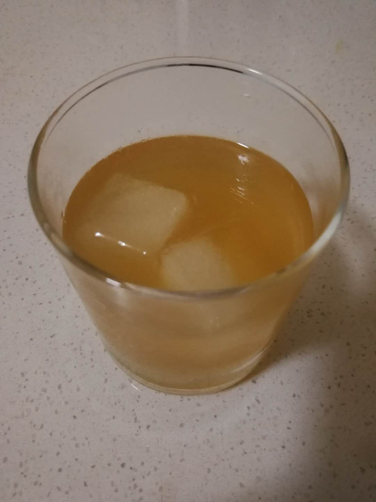

# Cossack

## 配方

材料            | 备注
-------------- |----------------
伏特加          | 2 oz
白兰地          | 2 oz
青柠汁          | 1 oz
糖浆            | 1 勺

## 备注

* 由于涉及两种基酒和糖浆，需要使用摇和法调制（即使用雪克杯）
* 虽然酒的比例比较高，相对的烈一点，但是柠檬味很好地的覆盖了酒的味道

## 配图

